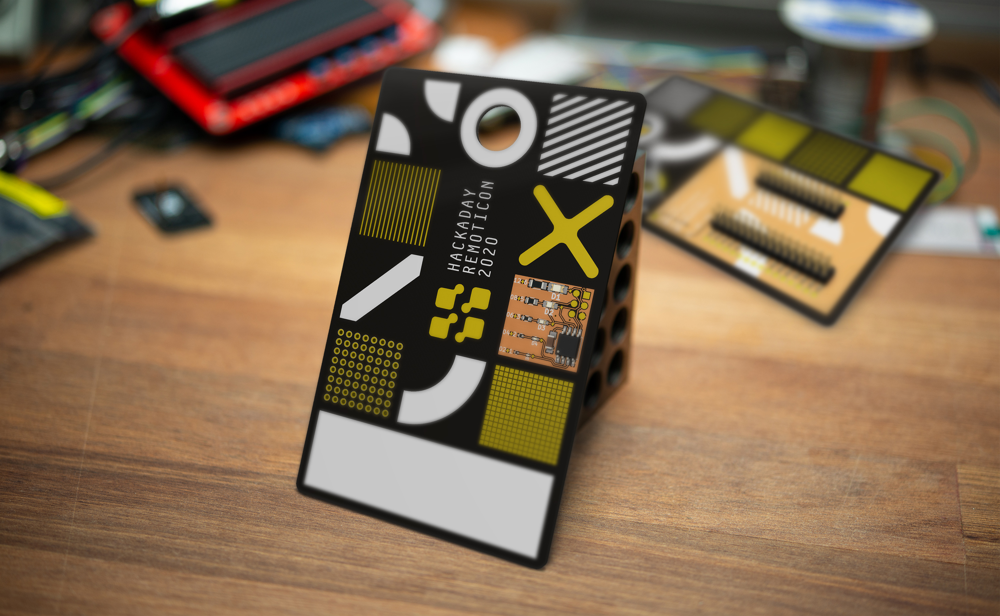

# Hackaday Remoticon 2020 Unofficial Badge by Thomas Flummer

## Physical badges for virtual events

This is an experiment and you are part of it. There is [no official badge](https://twitter.com/SophiKravitz/status/1308486813963767809) but I have been trying out the nightly builds of KiCad lately and there is a lot of awesome new features, that you can try too.

This badge is meant to be a basis for whatever you think would be cool on a badge. Simply fork this repository, change it to you liking and you can order exactly the badge you think would be cool, just remember to share it.

There is about a month until the 2020 Remoticon so there should be enough time to have the badge in hand for the event, though you might need to get some fast shipping on those PCBs.

## Mostly prototyping area and decoration

This badge is partly inspired by the event graphics and partly by the [first Superconference badge by Chris Gammell](https://twitter.com/Chris_Gammell/status/666028712828125184) and it's in the hope to see some fancy hacking, some free form soldering of tiny components or maybe the use this badge as base for a circuit sculpture of some sort. There are plenty of exposed copper pads to solder on and since more and more move in the direction of surface mount parts, there are a lot of area for those.

## SMD Soldering challenge

Another stable of many hacker events and not least the ones around the Hackaday crowd are soldering challenges with tiny little parts, competing not only on speed, but also on functionality and how nice the solderjoints are, component position, etc.

So in an attempt at bringing a little bit if the Superconference feel into the real world for this virtual event, I have added the [SMD challenge circuit](https://github.com/aspro648/KiCad/tree/master/projects/Attiny/Attiny85ChallengeHackaday2020) by [MakersBox](https://www.tindie.com/stores/makersbox/) as a way to show your awesome hand soldering capabilities.

## Adafruit Feather mounting option

On the back, I have added a few footprints for some SDM double row headers and broken all pins out to some test points. This is so that you don't have to solder wires or similar directly to the Feather, in case you want to reuse it for another project. I think the Feather platform is a great solution for badge prototypes, since they all have onboard LiPo power and charge funtionality, making it really easy to get a wearable design operational.

The GND on the Feather and GND on the SMD soldering challenge is connected and if you want to power the soldering challenge from the Feather, you can add a blob of solder on the small jumper on the back and then skip the coin cell all together.

## Making your own

If you want to make your own, I have included the gerbers, in case you don't want to install the nightly version of KiCad.

There is also a [shared projects at OSHPark](https://oshpark.com/shared_projects/1NAp0lZJ), just remember to select AfterDark, when checking out to get the same look as on the render in the top of this page. It will also function in Purple (or any other color for that matter), but will have a slightly different look.

The parts needed for the SMD Soldering challenge are listed on [MakersBox repository](https://github.com/aspro648/KiCad/tree/master/projects/Attiny/Attiny85ChallengeHackaday2020) and exactly which header you use for mounting a feather depens a little on what you have mounted on the Feather. It's a simple double row SMD footprint and the male pin breakaway type is probably the cheapest, and a low profile version is best, to keep the overall thickness as low as possible.

## Please share

If you decide to make this badge or a variant of it, please share images so we can all see it and get inspired. If sharing on social media, please use the #badgelife tag and please let [me](https://thomasflummer.com/) know, I would love to see what you have made!
